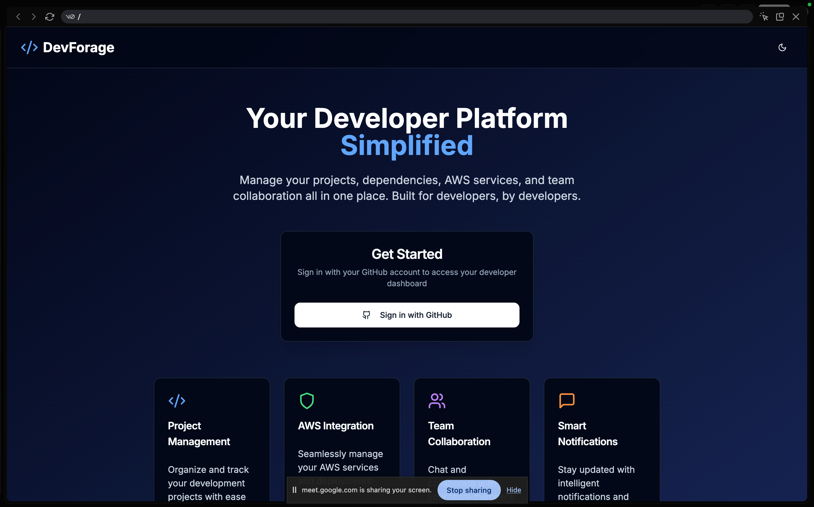
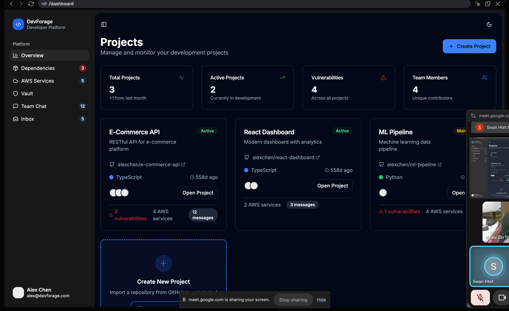
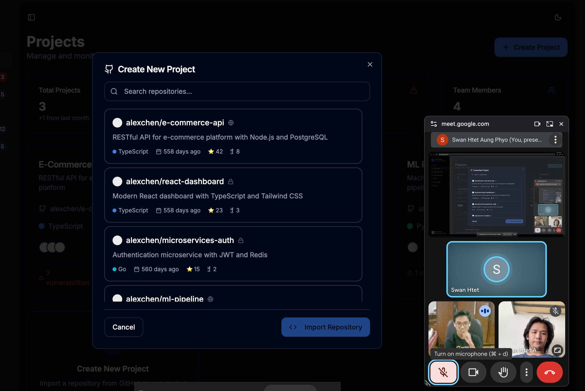
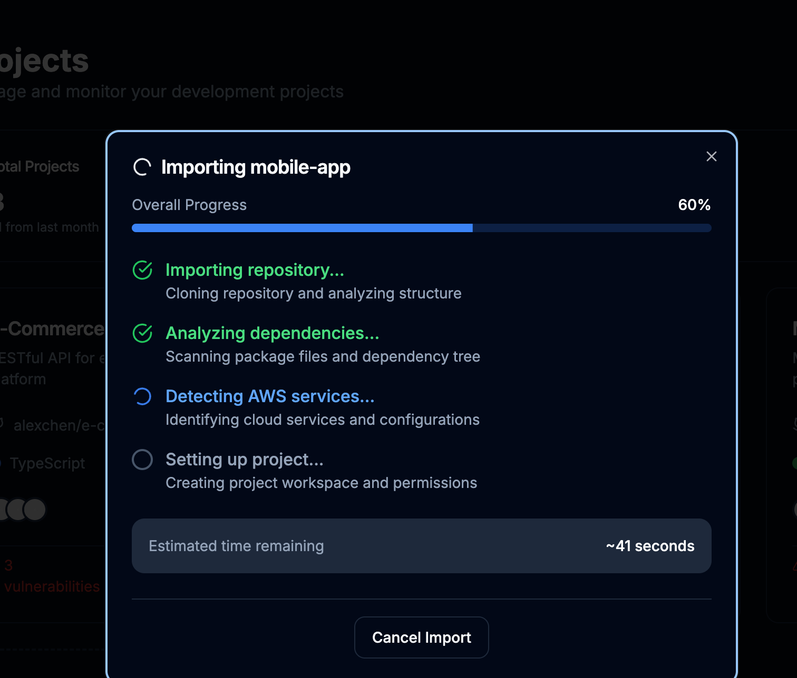
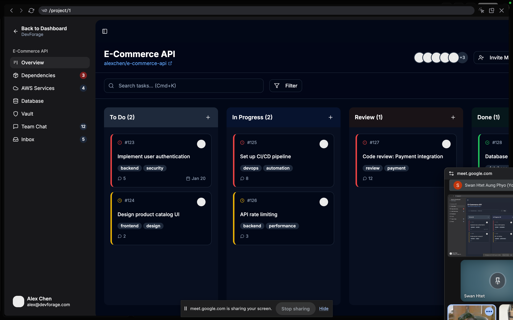
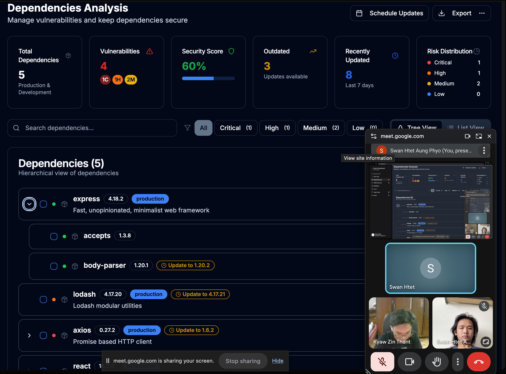
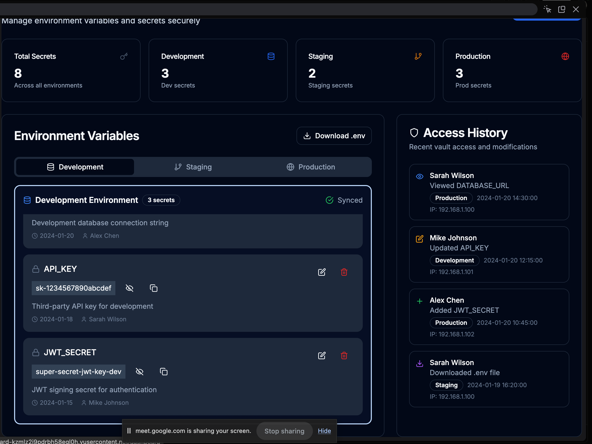
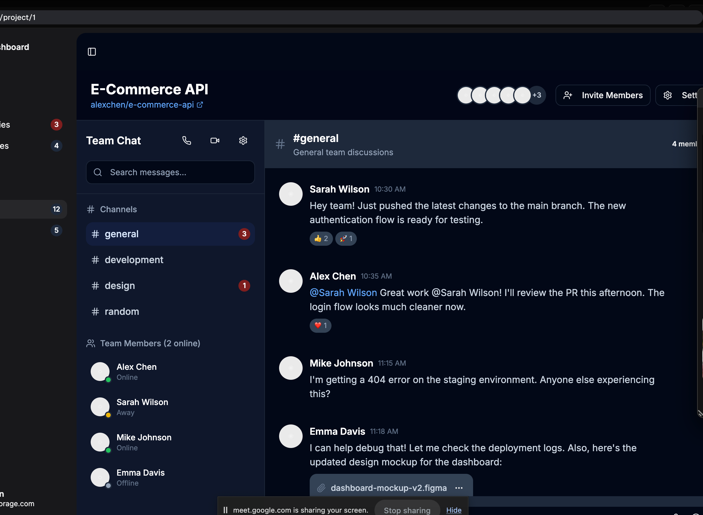

# kiro-hackathon-draft

# Kiro Hackathon Project - Frontend Features

## Table of Contents

- [Authentication & User Management](#authentication--user-management)
- [Repository Management Interface](#repository-management-interface)
- [Code Analysis Dashboard](#code-analysis-dashboard)
- [Dependency Analysis Interface](#dependency-analysis-interface)
- [Kanban Board System](#kanban-board-system)
- [Real-time Chat Interface](#real-time-chat-interface)
- [AWS Integration Dashboard](#aws-integration-dashboard)
- [Customizable Dashboard](#customizable-dashboard)
- [Team Management Interface](#team-management-interface)
- [Analytics & Reporting](#analytics--reporting)
- [Navigation & Layout](#navigation--layout)
- [Notification System](#notification-system)
- [Settings & Configuration](#settings--configuration)
- [Search & Filtering](#search--filtering)

---

## Term of Glossary

- Exploration
- Confirm

## Authentication & User Management

- [ ] Clerk Login
- [ ] GitPeek repo import
- [ ] Logout

[Back to top](#kiro-hackathon-project---frontend-features)

## Repository Management Interface

- [ ] Repository selection dropdown
- [ ] Branch selection interface (Exploration)
- [ ] Repository sync status indicator (Exploration)
- [ ] Repository health score display (Exploration)
- [ ] File explorer tree view
- [ ] Recent commits timeline (Exploration)

[Back to top](#kiro-hackathon-project---frontend-features)

## Code Analysis Dashboard

- [ ] Code quality score widgets
- [ ] Security vulnerability alerts panel
- [ ] Performance metrics charts
- [ ] Technical debt visualization
- [ ] Code complexity heatmaps
- [ ] File-level analysis results
- [ ] Line-by-line code review interface
- [ ] Issue filtering and sorting
- [ ] Trend analysis graphs
- [ ] Code standards compliance meter

[Back to top](#kiro-hackathon-project---frontend-features)

## Dependency Analysis Interface

- [ ] Interactive dependency tree/graph
- [ ] Package list with version info
- [ ] Vulnerability highlighting
- [ ] License information display
- [ ] Update recommendations panel
- [ ] Security advisory alerts
- [ ] Dependency conflict warnings
- [ ] Package search and filter
- [ ] Outdated packages list
- [ ] License compliance dashboard

[Back to top](#kiro-hackathon-project---frontend-features)

## Kanban Board System

- [ ] Drag-and-drop task interface
- [ ] Column customization panel
- [ ] Task creation modal
- [ ] Task detail view/editor
- [ ] Task assignment dropdown
- [ ] Priority level indicators
- [ ] Due date picker
- [ ] Labels and tags system
- [ ] Board switching tabs
- [ ] Task filtering sidebar
- [ ] Sprint planning interface
- [ ] Progress tracking charts

[Back to top](#kiro-hackathon-project---frontend-features)

## Real-time Chat Interface

- [ ] Channel sidebar navigation
- [ ] Message input with formatting toolbar
- [ ] File upload drag-and-drop
- [ ] Emoji picker
- [ ] Message reactions
- [ ] User online status indicators
- [ ] Chat notification badges
- [ ] Direct message interface
- [ ] Code snippet sharing
- [ ] Message search functionality
- [ ] Chat history pagination

[Back to top](#kiro-hackathon-project---frontend-features)

## AWS Integration Dashboard

- [ ] AWS services grid/card view
- [ ] Service dependency diagram
- [ ] Resource utilization charts
- [ ] Configuration details panel
- [ ] Cost breakdown pie charts
- [ ] Budget tracking interface
- [ ] Cost alerts notification panel
- [ ] Historical cost graphs
- [ ] Optimization recommendations
- [ ] Resource tagging interface
- [ ] Infrastructure monitoring widgets

[Back to top](#kiro-hackathon-project---frontend-features)

## Customizable Dashboard

- [ ] Drag-and-drop widget system
- [ ] Widget resize handles
- [ ] Dashboard layout templates
- [ ] Personal vs team dashboard toggle
- [ ] Widget configuration modals
- [ ] Dashboard sharing interface
- [ ] Custom widget builder
- [ ] Dashboard export functionality
- [ ] Grid layout system
- [ ] Widget library/marketplace

[Back to top](#kiro-hackathon-project---frontend-features)

## Team Management Interface

- [ ] Team member cards/list view
- [ ] User invitation modal
- [ ] Role assignment dropdown
- [ ] Permission matrix interface
- [ ] Team hierarchy tree view
- [ ] Access control settings panel
- [ ] User activity timeline
- [ ] Team statistics dashboard
- [ ] Member profile pages
- [ ] Bulk user operations

[Back to top](#kiro-hackathon-project---frontend-features)

## Analytics & Reporting

- [ ] Interactive line/bar charts
- [ ] Pie charts for distributions
- [ ] Performance trend graphs
- [ ] Code quality metrics display
- [ ] Team productivity charts
- [ ] Project timeline visualization
- [ ] Custom report builder
- [ ] Report template selector
- [ ] Export options (PDF, CSV, PNG)
- [ ] Scheduled reports interface
- [ ] Data filtering controls

[Back to top](#kiro-hackathon-project---frontend-features)

## Navigation & Layout

- [ ] Responsive sidebar navigation
- [ ] Breadcrumb navigation
- [ ] Header with user profile dropdown
- [ ] Search bar with autocomplete
- [ ] Theme toggle (dark/light)
- [ ] Language selector
- [ ] Notification bell with dropdown
- [ ] Quick actions menu
- [ ] Mobile hamburger menu
- [ ] Collapsible sidebar

[Back to top](#kiro-hackathon-project---frontend-features)

## Notification System

- [ ] Toast notifications
- [ ] In-app notification panel
- [ ] Email notification preferences
- [ ] Notification history
- [ ] Notification filtering
- [ ] Sound notification toggle
- [ ] Notification badges/counters
- [ ] Alert prioritization

[Back to top](#kiro-hackathon-project---frontend-features)

## Settings & Configuration

- [ ] User preferences panel
- [ ] Theme customization
- [ ] Keyboard shortcuts settings
- [ ] Dashboard layout configuration
- [ ] Notification preferences
- [ ] Integration settings (GitHub, AWS)
- [ ] Security settings
- [ ] Privacy controls
- [ ] Data export/import
- [ ] Account management

[Back to top](#kiro-hackathon-project---frontend-features)

## Search & Filtering

- [ ] Global search bar
- [ ] Advanced search filters
- [ ] Search result highlighting
- [ ] Search history
- [ ] Saved searches
- [ ] Filter presets
- [ ] Multi-criteria filtering
- [ ] Search suggestions
- [ ] Quick search shortcuts
- [ ] Search analytics

[Back to top](#kiro-hackathon-project---frontend-features)

---

## Imagination Application

[devforage](https://v0-modern-dev-platform-dashboard.vercel.app/)

## Lists To Delete from Imagination App

- Dependencies section on sidebar on platform main dashboard
- AWS services on sidebar on platform main dashboard
- Team chat section on sidebar on platform main dashboard
- Vault section on sidebar on platform main dashboard

## Need to be Reduced for MVP

- 50% of Database insight section

---

## UI Modification + User Stories

### Step 1 - Authentication

#### Modification Note

- Sign With Clerk
- After clicking the sign in with clerk, user will be asked to authorize the app with GitHub
---

### Step 2 - User Initial Dashboard State

#### Modification Note

- User will see the Project and metrics and button named create project
- **On left nav bar**
  - Overview
  - Team Chat
  - Inbox
  - Profile Section
---
### Step 3 - User Project Creation

- User will see the Create Project Button
- User will the select box where he can select the repo that he wanted to import
- User will select and click import repository button

- User will see the importing step
- If importing is failed, he will see the danger alert box
- User will the imported project list with card box on the main dashboard
---
### Step 4 - User Manage His Created Project

- User will click the open project button on the selected project card box
- After that, he will see the project dashboard with Kanban board by default

- User will the sidebar which will include:
  - Home, Inbox and Team by default (They are related to the whole account not the individual team)
  - **Separator**
  - Overview
  - Dependencies
  - AWS services
  - Database
  - Vault
---
### Step 5 - User Click Dependencies

- Users will see the Dependencies Analysis with:
  - Total Dependencies
  - Vulnerabilities
  - Security Score
  - Outdated
  - Risk Distribution

- Dependencies:
  - Dependencies list with tree view
  - Dependencies with tree view

---

### Step 6 - User Click Vault

User can share and store his secrets as the env file with the team member

- Users will see the Vault

---

### Step 7 - User Can Chat with Their Team

**Notes: Needed to be reduced scope**

---
### Step 8 - User Will See the Inbox
  
**Notes: Needed to be discussed (Exploration)**

---

### Step 9 - User Will See the AWS and Database

**Notes: Needed to be discussed (Exploration)**

---